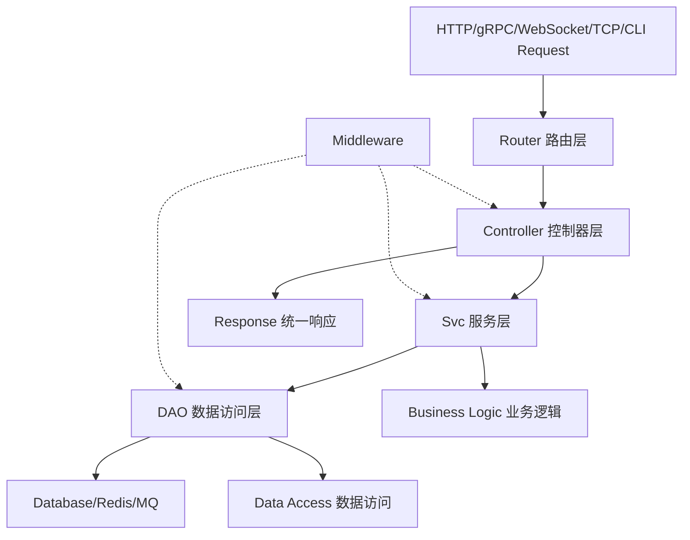
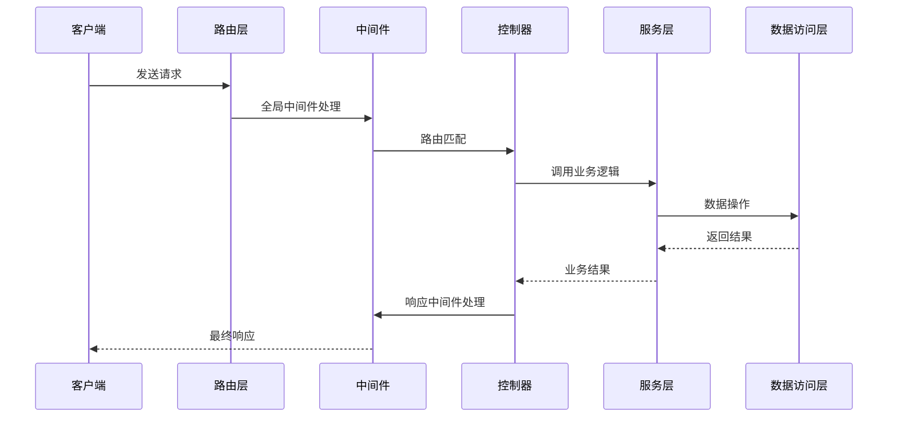
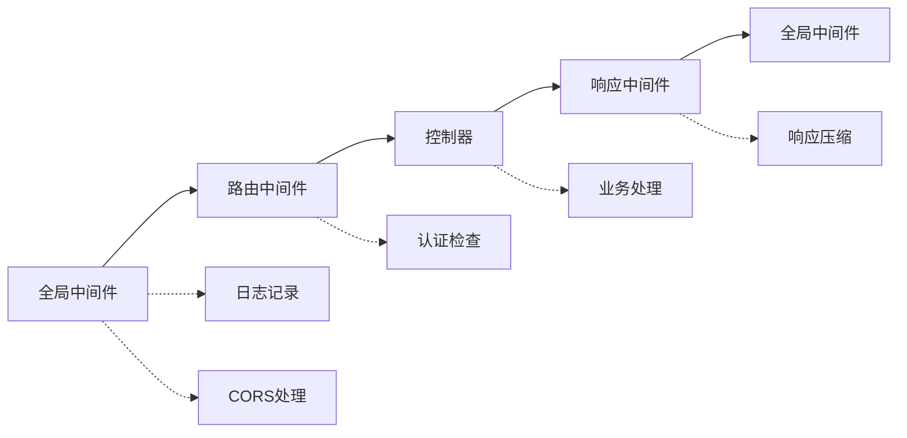
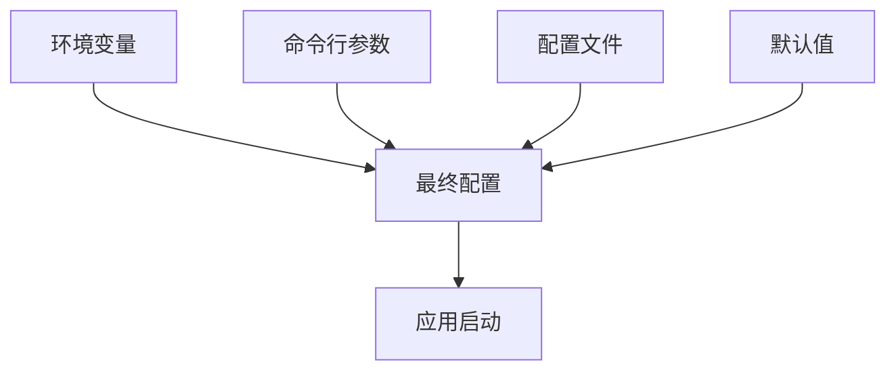
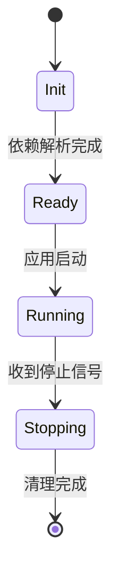

# 04. 核心概念详解 

在深入学习 Nyx 框架的具体使用之前，理解其核心概念和设计哲学至关重要。本章将从抽象层面解析 Nyx 框架的架构思想，帮助您理解为什么这样设计，以及如何更好地运用这个框架。

## 设计哲学：简化复杂性

### 1. 统一的接口，简单的体验

Nyx 框架的核心设计理念是**统一抽象，简化复杂性**。传统的 Web 框架往往需要开发者为不同的协议（HTTP、gRPC、WebSocket）编写不同的处理逻辑，导致代码分散、维护困难。

```go
// 传统方式：每种协议都需要不同的处理逻辑
func HandleHTTP(w http.ResponseWriter, r *http.Request) { /* HTTP 处理逻辑 */ }
func HandleGRPC(ctx context.Context, req *pb.Request) (*pb.Response, error) { /* gRPC 处理逻辑 */ }
func HandleWebSocket(conn *websocket.Conn) { /* WebSocket 处理逻辑 */ }

// Nyx 方式：统一接口处理所有协议
func (c *UserController) CreateUser(rw http.ResponseWriter, req *http.Request) nyx.Response {
    // 相同的业务逻辑，无需关心底层协议差异
    params := c.GetParams(req)
    user := &model.User{
        Username: params.GetString("username", ""),
        Email:    params.GetString("email", ""),
    }
    return c.Success(user)
}
```

### 2. 依赖注入的优雅实现

Nyx 通过**组合优于继承**的设计模式，实现了一个优雅的依赖注入系统：

```go
// 基础服务结构体
type Svc struct {
    ctx    context.Context
    db     *sql.DB
    cache  *redis.Client
    config map[string]interface{}
}

// 通过组合获得所有基础能力
type UserService struct {
    *Svc  // 组合基础服务，获得所有基础功能
}

func (s *UserService) GetUser(id int64) (*model.User, error) {
    // 可以直接使用 s.ctx, s.db, s.cache, s.config
    // 无需显式传递或初始化
}
```

这种设计带来的优势：
- **零配置依赖注入**：服务层自动获得数据库、缓存、配置等依赖
- **接口隔离**：各层之间通过接口解耦，测试友好
- **生命周期管理**：框架统一管理组件的创建和销毁

## 架构设计：分层的智慧

### 1. MVC 架构的现代实现

Nyx 重新定义了 MVC 架构，使其更适合现代微服务开发：



#### Model（模型层）- 数据结构定义
```go
type User struct {
    ID        int64     `json:"id"`
    Username  string    `json:"username"`
    Email     string    `json:"email"`
    CreatedAt time.Time `json:"created_at"`
}
```

#### Controller（控制器层）- 协议无关的请求处理
```go
type UserController struct {
    *nyx.BaseController  // 继承统一的请求处理能力
    userService *svc.UserService
}

func (c *UserController) CreateUser(rw http.ResponseWriter, req *http.Request) nyx.Response {
    // 协议无关的参数获取
    params := c.GetParams(req)
    
    // 协议无关的响应处理
    if params.GetString("username", "") == "" {
        return c.BadRequest("用户名不能为空")
    }
    
    return c.Success(user)
}
```

#### Svc（服务层）- 业务逻辑聚合
```go
type UserService struct {
    *Svc  // 自动获得数据库、缓存等依赖
    notificationService *NotificationService
}

func (s *UserService) CreateUser(user *model.User) error {
    // 事务处理
    tx, err := s.GetTx()
    if err != nil {
        return err
    }
    defer tx.Rollback()
    
    // 业务逻辑
    if err := dao.CreateUser(tx, user); err != nil {
        return err
    }
    
    // 发送通知
    s.notificationService.SendWelcomeEmail(user)
    
    return tx.Commit()
}
```

#### DAO（数据访问层）- 数据操作封装
```go
func CreateUser(db *sql.DB, user *model.User) error {
    query := "INSERT INTO users (username, email) VALUES (?, ?)"
    result, err := db.Exec(query, user.Username, user.Email)
    if err != nil {
        return err
    }
    
    id, _ := result.LastInsertId()
    user.ID = id
    return nil
}
```

### 2. 统一请求容器：RequestContainer

Nyx 的核心抽象是 `RequestContainer` 接口，它统一了所有协议的处理方式：

```go
type RequestContainer interface {
    // 参数获取
    GetParams() RequestParams
    GetHeader(key string) string
    GetCookie(name string) (*http.Cookie, error)
    
    // 响应处理
    Render(data interface{}, statusCode ...int)
    JSON(data interface{}, statusCode ...int)
    XML(data interface{}, statusCode ...int)
    
    // 上下文信息
    GetGuid() string
    GetRemoteAddr() string
    GetUserAgent() string
    
    // 错误处理
    Error(err error, statusCode ...int)
    InternalServerError(message string)
    BadRequest(message string)
    NotFound(message string)
}
```

这个设计的神奇之处在于：
- **协议透明**：无论 HTTP、gRPC 还是 CLI，控制器代码完全一致
- **开发体验一致**：开发者只需学习一套 API
- **易于测试**：可以轻松创建 mock 实现

## 请求生命周期：完整的处理链路

### 1. 请求处理流程



### 2. 生命周期的关键节点

#### 阶段 1：请求入口和路由匹配
```go
// 框架自动处理
func (app *Nyx) handleRequest(req *http.Request) {
    // 1. 路由匹配
    route := app.router.Match(req)
    if route == nil {
        return app.notFoundHandler(req)
    }
    
    // 2. 创建请求容器
    container := app.createRequestContainer(req, route)
    
    // 3. 链式中间件处理
    handler := app.buildHandlerChain(route.Handler, route.Middleware...)
    handler(req, route.Params)
}
```

#### 阶段 2：中间件链式执行
```go
func buildHandlerChain(handler HandlerFunc, middlewares []MiddlewareFunc) HandlerFunc {
    // 反向构建中间件链
    for i := len(middlewares) - 1; i >= 0; i-- {
        handler = middlewares[i](handler)
    }
    return handler
}
```

#### 阶段 3：控制器执行
```go
func (c *BaseController) ExecuteHandler(handler HandlerFunc, req *http.Request) {
    // 1. 参数解析
    params := c.ParseParams(req)
    
    // 2. 执行业务逻辑
    response := handler(req, params)
    
    // 3. 响应渲染
    c.RenderResponse(response)
}
```

## 中间件模式：横向切面的优雅实现

### 1. 中间件的抽象

Nyx 的中间件模式基于函数式编程思想：

```go
type MiddlewareFunc func(next HandlerFunc) HandlerFunc

func Logging() MiddlewareFunc {
    return func(next HandlerFunc) HandlerFunc {
        return func(req *http.Request, params RequestParams) nyx.Response {
            start := time.Now()
            
            // 请求前处理
            log.Printf("请求开始: %s %s", req.Method, req.URL.Path)
            
            // 执行下游处理
            response := next(req, params)
            
            // 请求后处理
            log.Printf("请求完成: %s %s - %v", req.Method, req.URL.Path, time.Since(start))
            
            return response
        }
    }
}
```

### 2. 中间件的执行顺序



### 3. 自定义中间件示例

#### 认证中间件
```go
func Auth() MiddlewareFunc {
    return func(next HandlerFunc) HandlerFunc {
        return func(req *http.Request, params RequestParams) nyx.Response {
            token := req.Header.Get("Authorization")
            
            if token == "" {
                return &Response{
                    Code: 401,
                    Message: "缺少认证令牌",
                }
            }
            
            // 验证 token
            if !validateToken(token) {
                return &Response{
                    Code: 401,
                    Message: "无效的认证令牌",
                }
            }
            
            // 验证通过，继续处理
            return next(req, params)
        }
    }
}
```

#### 限流中间件
```go
func RateLimit(limit int) MiddlewareFunc {
    limiter := rate.NewLimiter(rate.Every(time.Second), limit)
    
    return func(next HandlerFunc) HandlerFunc {
        return func(req *http.Request, params RequestParams) nyx.Response {
            if !limiter.Allow() {
                return &Response{
                    Code: 429,
                    Message: "请求过于频繁",
                }
            }
            return next(req, params)
        }
    }
}
```

## 配置管理：环境无关的部署

### 1. 分层配置设计

Nyx 实现了灵活的分层配置系统：



#### 配置文件结构
```toml
# conf/app.toml (基础配置)
[app]
name = "my-app"
version = "1.0.0"

[server]
host = "0.0.0.0"
port = 8080

[database]
driver = "mysql"
host = "localhost"
port = 3306

# conf/dev.toml (开发环境覆盖)
[server]
port = 8081

[database]
password = "dev_password"

[log]
level = "debug"

# conf/prod.toml (生产环境覆盖)
[server]
port = 80

[database]
host = "prod-db.example.com"
password = "prod_password"

[log]
level = "info"
```

### 2. 配置的自动注入

```go
type AppConfig struct {
    Name    string `json:"name"`
    Version string `json:"version"`
    
    Server struct {
        Host    string `json:"host"`
        Port    int    `json:"port"`
        SSL     bool   `json:"ssl"`
    } `json:"server"`
    
    Database struct {
        Driver     string `json:"driver"`
        Host       string `json:"host"`
        Port       int    `json:"port"`
        Username   string `json:"username"`
        Password   string `json:"password"`
        Database   string `json:"database"`
        MaxConns   int    `json:"max_conns"`
    } `json:"database"`
}

// 配置自动加载到服务层
type Svc struct {
    config *AppConfig
    db     *sql.DB
    cache  *redis.Client
}

func New(config *AppConfig) *Svc {
    return &Svc{
        config: config,
        db:     initDB(config),
        cache:  initCache(config),
    }
}
```

## 错误处理：一致的错误响应

### 1. 统一错误格式

Nyx 定义了标准的响应格式：

```go
type Response struct {
    Code    int         `json:"code"`
    Message string      `json:"message"`
    Data    interface{} `json:"data,omitempty"`
    Guid    string      `json:"guid,omitempty"`
}

type ErrorResponse struct {
    Code    int    `json:"code"`
    Message string `json:"message"`
    Error   string `json:"error,omitempty"`
    Guid    string `json:"guid,omitempty"`
}
```

### 2. 错误处理的最佳实践

```go
func (c *BaseController) CreateUser(rw http.ResponseWriter, req *http.Request) nyx.Response {
    params := c.GetParams(req)
    
    // 参数验证
    if username := params.GetString("username", ""); username == "" {
        return c.BadRequest("用户名不能为空")
    }
    
    if email := params.GetString("email", ""); email == "" {
        return c.BadRequest("邮箱不能为空")
    }
    
    // 业务逻辑
    user := &model.User{
        Username: username,
        Email:    email,
    }
    
    if err := c.userService.CreateUser(user); err != nil {
        // 记录错误日志
        log.Printf("创建用户失败: %s, GUID: %s", err.Error(), c.GetGuid())
        
        // 根据错误类型返回不同响应
        if isDuplicateError(err) {
            return c.Conflict("用户名或邮箱已存在")
        }
        
        return c.InternalServerError("系统内部错误")
    }
    
    return c.Success(user)
}
```

## 依赖注入：自动化的组件管理

### 1. 组件生命周期



### 2. 服务注册和发现

```go
type Service interface {
    Name() string
    Start(ctx context.Context) error
    Stop(ctx context.Context) error
}

type ServiceRegistry struct {
    services map[string]Service
}

func (r *ServiceRegistry) Register(service Service) {
    r.services[service.Name()] = service
}

func (r *ServiceRegistry) Get(name string) Service {
    return r.services[name]
}
```

### 3. 自动依赖解析

```go
type UserService struct {
    db     *sql.DB     `inject:"database"`
    cache  *redis.Client `inject:"cache"`
    config *AppConfig   `inject:"config"`
    email  *EmailService `inject:"email"`
}

func NewUserService() *UserService {
    svc := &UserService{}
    injectDependencies(svc)
    return svc
}

func injectDependencies(target interface{}) {
    // 反射解析 struct tag，自动注入依赖
    reflect.ValueOf(target).Elem().FieldByNameFunc(func(fieldName string) bool {
        // 根据 field tag 自动注入相应的服务实例
        return true
    })
}
```

## 测试友好：解耦的架构设计

### 1. 接口驱动的测试

```go
// 定义接口
type UserService interface {
    CreateUser(user *model.User) error
    GetUser(id int64) (*model.User, error)
}

// 实现
type UserServiceImpl struct {
    *Svc
}

func (s *UserServiceImpl) CreateUser(user *model.User) error {
    return dao.CreateUser(s.GetDB(), user)
}

// 测试 mock
type MockUserService struct {
    users map[int64]*model.User
    nextID int64
}

func (m *MockUserService) CreateUser(user *model.User) error {
    user.ID = m.nextID
    m.users[m.nextID] = user
    m.nextID++
    return nil
}
```

### 2. 控制器测试

```go
func TestUserController_CreateUser(t *testing.T) {
    // 准备 mock 服务
    mockUserService := &MockUserService{
        users: make(map[int64]*model.User),
    }
    
    controller := &UserController{
        BaseController: nyx.NewBaseController(),
        userService:    mockUserService,
    }
    
    // 创建测试请求
    req := createTestRequest("POST", "/api/users", map[string]string{
        "username": "test",
        "email":    "test@example.com",
    })
    
    // 执行测试
    response := controller.CreateUser(nil, req)
    
    // 验证结果
    assert.Equal(t, 0, response.Code)
    assert.NotNil(t, response.Data)
}
```

## 扩展性：面向未来的设计

### 1. 插件化架构

```go
type Plugin interface {
    Name() string
    Init(app *Nyx) error
    Handle(ctx context.Context, req *http.Request) nyx.Response
}

type PluginRegistry struct {
    plugins map[string]Plugin
}

func (r *PluginRegistry) Register(plugin Plugin) {
    r.plugins[plugin.Name()] = plugin
}
```

### 2. 协议扩展

```go
type ProtocolHandler interface {
    HandleRequest(req interface{}) nyx.Response
}

type GRPCHandler struct {
    controller Controller
}

func (h *GRPCHandler) HandleRequest(req interface{}) nyx.Response {
    // gRPC 请求转换
    httpReq := convertToHTTPRequest(req)
    
    // 调用控制器
    return h.controller.Execute(httpReq)
}
```

## 小结：理解设计的精髓

通过本章的学习，您应该理解 Nyx 框架的核心理念：

### 🎯 设计目标
- **简化开发体验**：一套 API 处理所有协议
- **提高代码复用**：统一的业务逻辑处理
- **增强可维护性**：清晰的层次分离

### 🔧 技术特点
- **统一接口抽象**：RequestContainer
- **组合优于继承**：Svc 结构体
- **中间件模式**：横向切面处理
- **依赖注入**：自动化的组件管理

### 📈 架构优势
- **协议无关**：同一套代码支持多种协议
- **测试友好**：接口驱动的解耦设计
- **扩展性强**：插件化和组件化架构
- **配置灵活**：环境无关的部署方案

理解了这些核心概念，您就掌握了 Nyx 框架的设计精髓。下一章我们将深入学习配置系统的使用方法。

---

**下一步**：继续学习 [配置系统详解](./05-configuration.md)
