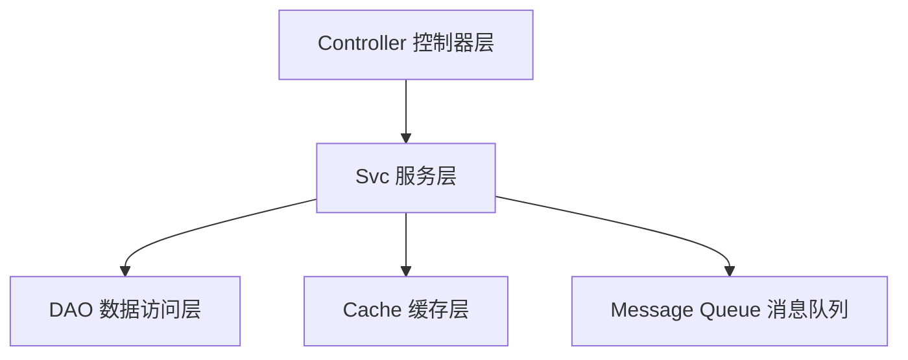

# 07. 服务层详解
## 业务逻辑的核心枢纽

服务层（Svc）是 Nyx 框架 MVC 架构中的核心组件，负责承载复杂的业务逻辑，协调各个业务模块，处理数据事务，并提供对外的服务接口。本章将深入讲解服务层的架构设计、实现原理和最佳实践。

## 服务层的架构设计

### 1. MVC 架构中的服务层定位



### 2. 服务层的设计原则

#### 单一职责原则
每个服务只负责一个特定的业务领域：

```go
// 用户服务 - 只负责用户相关业务
type UserService struct {
    *Svc
    userDAO     *dao.UserDAO
}

// 订单服务 - 只负责订单相关业务
type OrderService struct {
    *Svc
    orderDAO    *dao.OrderDAO
}
```

#### 依赖注入原则
通过组合获得所需依赖：

```go
type Svc struct {
    ctx       context.Context
}

type UserService struct {
    *Svc  // 组合基础服务
    userDAO *dao.UserDAO
}

func (s *UserService) CreateUser(user *model.User) error {
    // 无需显式传递这些依赖
    return s.userDAO.AddUser(user)
}
```

## 小结

通过本章的学习，您已经掌握了 Nyx 框架服务层的核心概念：

### 🎯 核心特性
- **业务逻辑聚合** - 服务层承载复杂的业务规则和数据处理
- **单一职责** - 每个服务只负责一个特定的业务领域
- **依赖注入** - 优雅的组件组合和生命周期管理

服务层是 Nyx 框架业务逻辑的核心，它将控制器层和DAO层有机结合，提供强大的业务处理能力。

---

**下一步**：继续学习 [数据访问层详解](./08-dao.md)
